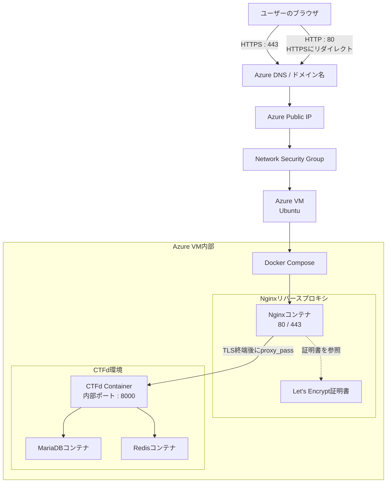
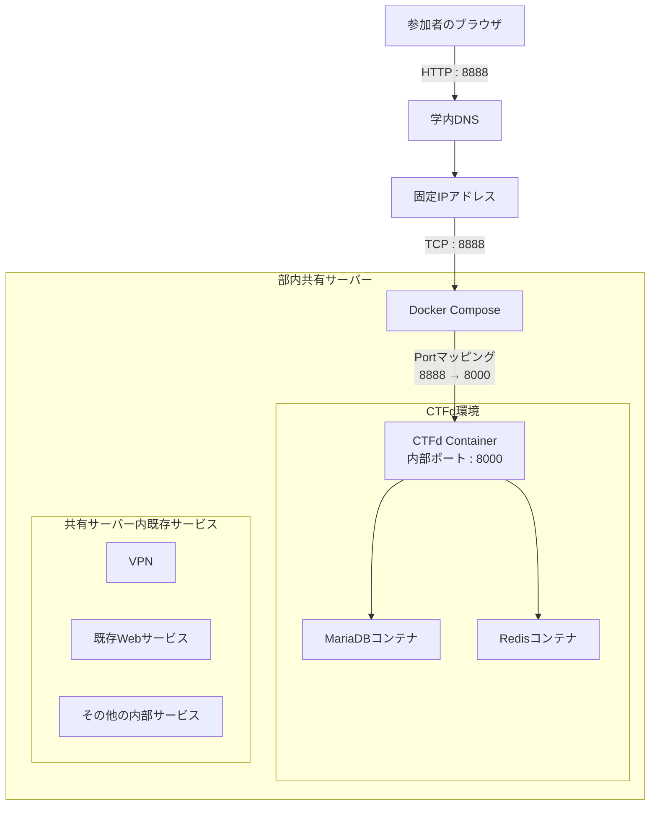

# CTFd Infrastructure Notes

Azure上でのCTFd構築と、学内CTFイベント「KIT OSINT CTF」におけるCTFd運用経験を整理した記録です。

このリポジトリでは、CTFdを用いたCTF環境の構築・運用を通じて学んだ、クラウドインフラ、ネットワーク、Docker、HTTPS化、サーバー運用に関する内容をまとめています。

公開用の記録であるため、学内ネットワークの具体的なIPアドレス、内部サービス名、認証情報、秘密鍵、SECRET_KEYの値などは一部抽象化しています。

---

## 概要

扱う経験は以下の2つです。

1. Azure上でのCTFd環境構築  
   個人学習として、Azure上にCTFプラットフォームを構築しました。VNet、サブネット、NSG、Ubuntu VM、Docker Compose、Nginx、Let’s EncryptによるHTTPS化を経験しました。

2. KIT OSINT CTF  
   学内CTFイベントの開催に向けて、部室のオンプレミスサーバー上にCTFdを構築・運用しました。既存サービスとの共存、学内ネットワーク制約、運用時の安定性を考慮しました。

---

# 1. Azure上でのCTFd構築

## 期間

春休み中に約2週間程度。

構築作業だけでなく、各設定の意味を理解していくための時間も含めて取り組みました。

## 目的

クラウドインフラ、ネットワーク、セキュリティの基礎を実践的に学ぶため、個人学習としてAzure上にCTFプラットフォームを構築しました。

クラウド上でサービスを公開する際に必要となる以下の要素を一連の流れとして経験することを目的としました。

- 仮想ネットワークの作成
- VMの構築
- SSHによる接続
- NSGによる通信制御
- Docker Composeによる複数コンテナ構成
- Nginxによるリバースプロキシ
- Let’s EncryptによるHTTPS化

ここでCTFdをサービスとして選んだのは、CTFプラットフォームとして利用経験を積めることに加え、KIT OSINT CTFでオンプレミスサーバーに不具合が発生した際の代替案として活用できる可能性も考えていたためです。

## 環境

- Azure for Students
- Ubuntu VM
- Windows端末
- SSH接続環境

## 使用技術

- Azure
- Ubuntu
- SSH
- Docker
- Docker Compose
- Nginx
- CTFd
- Certbot
- Let’s Encrypt

## 構成

Azure上にUbuntu VMを構築し、そのVM上でDocker Composeを用いてCTFd環境を構成しました。

外部からの通信はNginxコンテナで受け取り、HTTPS化したうえでCTFdコンテナへ転送する構成にしました。

構成要素は以下の通りです。

- Azure VNet
- Subnet
- Network Security Group
- Ubuntu VM
- Docker Compose
- Nginx
- CTFd
- Database
- Redis
- Let’s Encrypt

### Azure上でのCTFd構築構成  

## 具体的に行ったこと

Azure上にVNetとサブネットを作成し、そのサブネット上にUbuntu VMを構築しました。

NSGでは、管理用のSSH 22番ポートは自分のIPアドレスからのみ許可し、Web公開用のHTTP 80番とHTTPS 443番を許可するように設定しました。

VMにはSSHで接続し、既存のDocker関連パッケージを整理したうえで、Docker公式リポジトリからDocker CEとDocker Composeを導入しました。

その後、Docker Composeを用いて以下のコンテナを複数コンテナ構成で起動しました。

- CTFd本体
- データベース
- Redis
- Nginx

また、AzureのPublic IPにDNSラベルを設定し、Azureが提供するDNS名でアクセスできるようにしました。

HTTPS化では、Certbotを用いてLet’s EncryptからSSL/TLS証明書を取得し、Nginxの設定を変更しました。

具体的には、以下のような構成にしました。

- 80番ポートへのHTTPアクセスを443番ポートのHTTPSへリダイレクト
- 443番ポートでは取得した証明書を用いてTLS終端
- 復号後のリクエストをDocker内部のCTFdコンテナへ転送
- NginxをCTFdへのリバースプロキシとして利用

## 詰まったこと

### Azure for Students環境におけるリージョン制限

Azure VMをデプロイしようとした際、ポータル上の入力内容には問題がないように見えたものの、実際のデプロイに失敗しました。

最初は原因が分からなかったため、Azureのアクティビティログやエラー詳細を確認しました。その結果、JSON形式のエラー内容から、Azure Policy によってデプロイが拒否されていることが分かりました。

さらに Policy の内容を確認したところ、Azure for Students 環境では利用可能なリージョンが制限されていることが原因だと分かりました。最終的には、利用可能なリージョンを選び直すことでデプロイを進めることができました。

この経験から、クラウドサービスはGUI上では分かりやすく操作できる一方で、実際にはサブスクリプションやポリシーなどの制約が裏側で評価されていることを学びました。原因が分からないときには、画面上の表示だけで判断せず、クラウド環境であってもログやエラー詳細から裏側の処理を確認することが重要だと実感しました。

### Docker / Nginx / HTTPS化まわりの理解

Docker導入時のGPGキーや公式リポジトリ設定、Let’s Encrypt証明書をNginxコンテナに読み込ませるためのdocker-compose.yml修正、NginxのHTTPS設定などは、生成AIを用いて調査しながら手順を追う形で進めました。

そのため、構築後に各設定の意味を整理し直しました。

特に、以下の点を後から重点的に確認しました。

- Docker公式リポジトリを追加する理由
- Docker Composeで複数コンテナを管理する意味
- Nginxがリバースプロキシとして担う役割
- Let’s Encryptで取得した証明書をNginxから参照する流れ
- HTTPからHTTPSへリダイレクトする理由
- TLS終端後にCTFdコンテナへ転送する仕組み

## 理解できていること

現時点で、以下の内容については大枠を理解しています。

- Azure上でVNet、サブネット、NSG、VMが持つ役割
- SSH、HTTP、HTTPSのポート制御を行う理由
- NSGによって外部からの通信を制御する考え方
- Docker Composeによって複数コンテナをまとめて管理すること
- Nginxが外部通信を受け取り、CTFd本体へ転送すること
- Let’s Encryptの証明書を使ってHTTPS化する流れ
- HTTPからHTTPSへリダイレクトする構成
- TLS終端とリバースプロキシの大まかな役割

## まだ理解が浅いこと

一方で、以下の内容についてはまだ理解が浅く、今後さらに学習が必要だと感じています。

- Docker導入時のGPGキーやリポジトリ追加の詳細
- Linuxコマンドの細かい意味
- docker-compose.ymlをゼロから自力で設計する力
- Nginx設定ファイルをゼロから自力で書く力
- VMサイズやマシンスペック選定の基準
- 本番運用を想定した監視、バックアップ、ログ管理

今後は、構築手順を整理しながら、各設定の意味を自分の言葉で説明できるようにしていきたいです。

## 成果

Azure上にCTFdを構築し、DNS名でアクセスできるHTTPS対応のCTFプラットフォームを公開できました。

この経験を通じて、単にアプリケーションを動かすだけでなく、以下の一連の流れを経験できました。

- クラウドネットワークの構築
- NSGによる通信制御
- SSH公開鍵認証
- Docker Composeによる複数コンテナ構成
- Nginxによるリバースプロキシ
- Let’s EncryptによるHTTPS化
- クラウド上でサービスを公開するまでの基本的な流れ

## 運用の有無

この取り組みは個人学習としての構築が中心であり、実際のイベント運用は行っていません。

---

# 2. KIT OSINT CTF

## 期間

2025年11月頃に構想開始。

2026年4月15日にイベントを開催しました。

自分がインフラ面で本格的に関わり始めたのは、2026年3月後半から4月上旬頃です。

## 目的

プロジェクト活動の中でCTFの面白さを学内に広めたいと考えたため、KIT OSINT CTFを企画・開催しました。

また、新入生や他学科の学生に対して、セキュリティ分野の魅力を体感してもらうことも目的としていました。

## 環境

- 学内部室の共用サーバーPC
- Ubuntu
- Docker / Docker Compose
- CTFd
- Nginx
- MariaDB
- Redis
- テスト用ノートPC

サーバーPCには学内ネットワーク上の固定IPが割り当てられており、参加者側クライアントが所属する別セグメントからのアクセスも考慮する必要がありました。

## 使用技術

- Ubuntu
- Docker
- Docker Compose
- CTFd
- Nginx
- MariaDB
- Redis
- Linuxネットワークコマンド
  - ip route
  - ip route get
  - arp
  - ss
  - tcpdump など

## 自分の役割

イベント全体では、以下の内容に関わりました。

- 作問協力
- 問題テスト
- ヒント作成
- 広報ポスター作成
- イベント方針協議

インフラ面では、主に以下を担当しました。

- CTFd環境構築
- 運用前設定
- 既存サービスとのポート競合確認
- ネットワークトラブルの調査
- 復旧方針の整理
- 本番運用時の構成判断

## 構成

学内の共用サーバー上にDocker Composeを用いてCTFdを構築しました。

当初はNginx経由の構成も検討しましたが、学内ネットワークの制約や本番直前の安定性を考慮し、最終的には動作確認済みの8888番ポートでCTFd本体へアクセスする構成を採用しました。

構成要素は以下の通りです。

- 学内共用サーバー
- Ubuntu
- Docker Compose
- CTFd
- MariaDB
- Redis
- 既存サービス
- 参加者側クライアント

### オンプレミス共有サーバー上でのCTFd運用構成

## 具体的に行ったこと

イベント企画段階では、問題作成、問題テスト、ヒント作成、広報物の作成に関わりました。

インフラ面では、まず部内共用サーバーで稼働している既存サービスと使用ポートを確認しました。

共用サーバー上では、既にWebサービス、VPN、DNS関連サービスなどが動作していたため、それらと競合しないようにCTFdのDocker Compose設定を調整しました。

CTFd導入後には、Docker Composeが自動生成した内部ネットワークと、学内ネットワークの一部が重複する問題が発生しました。

具体的には、Dockerの内部ブリッジネットワークとして作成されたプライベートIP帯が、参加者側クライアントの存在する学内ネットワークのIP帯と重複し、参加者側ネットワーク宛の通信がDockerブリッジ側へ向いてしまう状態になりました。

この問題に対して、`ip route`、`ip route get`、`arp`、`ss` などを用いて通信経路や稼働中サービスを確認しました。

復旧時には、既存のサービスを止めないことを優先しました。

そのため、サーバー全体の再起動や不用意なiptables操作は避け、まず現在の状態を確認し、通信経路や稼働中サービスを整理することから始めました。

最終的には、Docker Compose側の `default` / `internal` ネットワークを、学内ネットワークと重複しないIP帯へ変更する方針で整理しました。

また、参加者数が想定より増える可能性があったため、サーバーPCのCPU、メモリ、ネットワーク状態を確認しました。

そのうえで、CTFdのGunicorn Worker数を増やし、複数Worker構成に必要な `SECRET_KEY` も設定しました。

本番直前には、Nginx経由の構成も検討しました。

しかし、学内ネットワークの制約により接続が不安定になる可能性がありました。

そのため、イベント当日まで大きな構成変更を避け、動作確認済みの8888番ポートでCTFd本体へアクセスする構成を優先しました。

## 発生した課題

### 既存サービスとの共存

部室の共用サーバーには既に複数のサービスが稼働していました。

そのため、CTFdを新しく導入する際には、既存サービスに悪影響を与えないように注意する必要がありました。

特に以下の点を確認しました。

- 使用中のポート
- 稼働中のサービス
- Dockerコンテナの状態
- サーバー全体のリソース状況

この経験から、共用サーバーで新しいサービスを立ち上げる際には、単に自分のサービスだけを動かすのではなく、既存環境全体への影響を考える必要があると学びました。

### Dockerネットワークと学内ネットワークのIP帯重複

最も大きな課題は、Docker Composeが自動生成した内部ブリッジネットワークと、学内ネットワークの一部が重複したことです。

この影響で、参加者側ネットワーク宛の通信が、本来向かうべき学内ネットワークではなくDockerブリッジ側へ向いてしまいました。

当初は原因が分かりにくく、外部からのアクセスや通信経路の確認に時間がかかりました。

そこで、すぐに設定を変更するのではなく、まず現状を確認することを優先しました。

以下のような観点で調査しました。

- サーバーが持つネットワークインターフェース
- ルーティングテーブル
- 参加者側ネットワークへの通信経路
- 稼働中サービスと使用ポート
- Dockerが作成したブリッジネットワーク
- 一時的に追加されていた経路設定

そのうえで、Docker Compose側のネットワーク定義を見直し、学内ネットワークと重複しないIP帯を使う方針で対応しました。

### 本番直前の構成判断

本番環境では、Nginx経由の構成も検討していました。

しかし、学内ネットワークの制約やポート制限により、Nginx経由の構成では接続が不安定になる可能性がありました。

イベント直前に大きな構成変更を行うことはリスクが高いと判断し、当日は動作確認済みの構成を優先しました。

具体的には、8888番ポートでCTFd本体へ直接アクセスする構成を採用しました。

この判断により、理想的な構成に固執するのではなく、イベントを安定して成立させることを優先しました。

## 対応

Dockerネットワークと学内ネットワークのIP帯重複に対して、以下のように対応しました。

1. 現在のルーティング状況を確認
2. 稼働中サービスと使用ポートを確認
3. Dockerが自動生成したネットワークを確認
4. 一時的に追加されていた経路設定を整理
5. Docker Compose側のネットワーク定義を見直し
6. 学内ネットワークと重複しないIP帯へ変更する方針を整理

また、本番運用に向けて以下の対応を行いました。

- サーバーPCのCPU、メモリ、ネットワーク状態を確認
- CTFdのGunicorn Worker数を増加
- 複数Worker構成に必要な `SECRET_KEY` を設定
- Nginx経由ではなく、動作確認済みの8888番ポートでのアクセス構成を採用
- 本番直前の大きな構成変更を避ける判断

## 成果

結果として、36名が参加する学内CTFイベントを大きな障害なく実施できました。

CTFd環境についても、イベント当日に大きな障害は発生せず、参加者が問題へ取り組める環境を提供できました。

この経験を通じて、単にサーバーを構築するだけでなく、以下の重要性を学びました。

- 既存サービスへの影響を避けること
- 稼働中の環境では安易な再起動や設定変更を避けること
- トラブル時にはまず現状を観測すること
- 通信経路や稼働中サービスを確認したうえで原因を切り分けること
- 理想的な構成に固執せず、イベントを安定して成立させることを優先すること
- 利用者がいる環境では、技術的な理想と運用上の安定性のバランスを取ること

## 学び

今回の経験から、インフラにおいて重要なのは、単にサービスを動かすことだけではないと学びました。

特に、既存サービスが稼働している共用サーバー上では、自分が追加するサービスだけでなく、サーバー全体の状態を把握する必要があります。

また、トラブルが発生した際には、すぐに設定を変更するのではなく、まず現在の状態を確認し、何が原因なのかを切り分けることが重要だと実感しました。

さらに、本番直前には、理想的な構成を目指すよりも、動作確認済みの安定した構成を優先する判断も必要でした。

この経験を通じて、インフラ運用では技術的な知識だけでなく、目的から逆算して構成を判断する力が重要であると学びました。

---

# 今後の課題

今後は、以下の内容についてさらに理解を深めていきたいです。

- Docker Composeのネットワーク設計
- Nginxのリバースプロキシ設定
- HTTPS化の詳細
- Linuxネットワークコマンドの理解
- 監視、ログ管理、バックアップ
- 本番運用を想定したサーバー構成
- クラウド環境とオンプレミス環境の違い
- インフラ構成図の作成
- READMEとして技術経験を分かりやすく整理する力

---

# まとめ

Azure上でのCTFd構築では、クラウド上でサービスを公開するための基本的な流れを経験しました。

一方、KIT OSINT CTFでは、学内の共用サーバーという制約のある環境で、実際に参加者が利用するCTFd環境を構築・運用しました。

どちらの経験も、単にCTFdを動かすだけではなく、ネットワーク、セキュリティ、Docker、HTTPS化、既存サービスとの共存、運用判断について考えるきっかけになりました。

今後も、構築手順をなぞるだけではなく、各設定の意味を自分の言葉で説明できるように理解を深めていきたいです。
